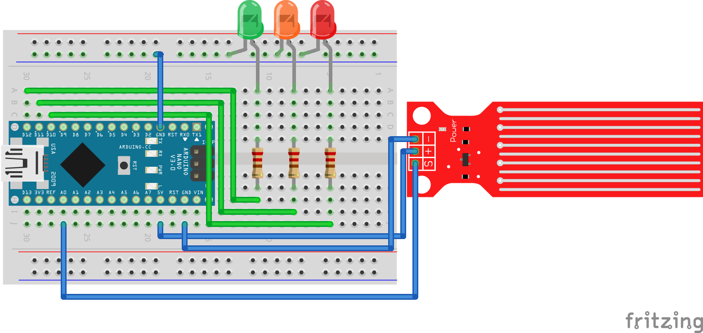
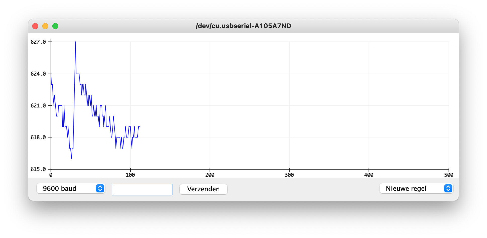
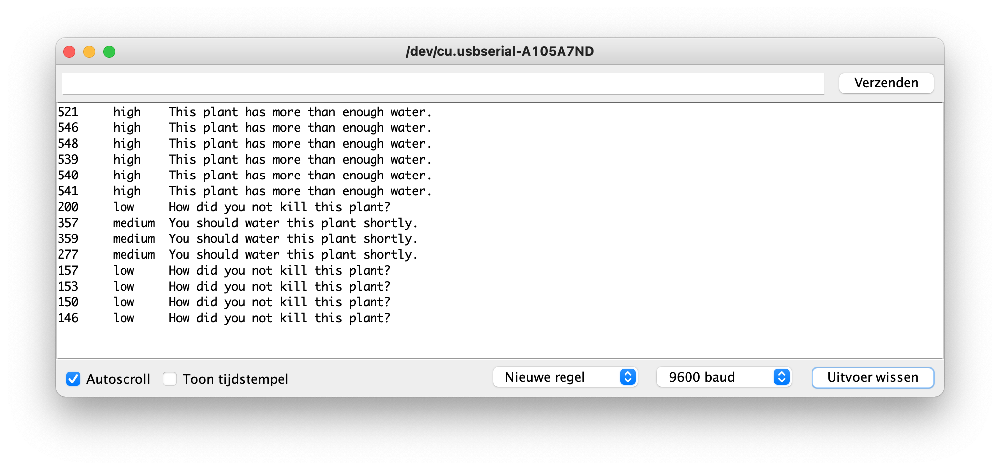
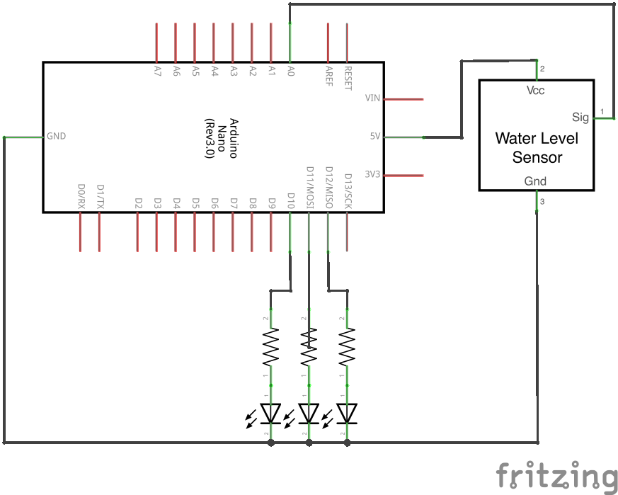

# Plant Water Sensor

Measures the concentration of water in a plant and tells you whether the plant needs water.

## Requirements

- Arduino
- Water Sensor
- 3 jumper wires (male to female)

And optionally, if you want LEDs to tell the output:

- 4 jumper wires (male to male)
- Red, yellow/orange and green LED
- 3x 220 ohm resistor

## How to use

### Wiring

Wire up above components as follows:

### Installation

Upload the [.ino file](arduino_plant_water_sensor.ino) to your Arduino using the [Arduino IDE](https://www.arduino.cc/en/software).

### Settings

You could modify the available settings at the top of the file as per your requirements:

| Name | Description | Type | Default |
|--|--|--|--|
| `MONITOR` | Monitor type to use. | `"monitor"` for text and `"plotter"` for chart | `"monitor"` |
| `PIN_SIGNAL` | Signal pin, which goes to the water sensor. | Pin number | `A0` |
| `LED_LOW` | Pin of the LED which blinks if there is too less water. | Pin number | `10` |
| `LED_MEDIUM` | Pin of the LED which blinks if there is a medium concentration of water. | Pin number | `11` |
| `LED_HIGH` | Pin of the LED which blinks if there is enough water. | Pin number | `12` |

#### `MONITOR`

| Plotter | Serial |
|--|--|
|  |  |

## Schematics

